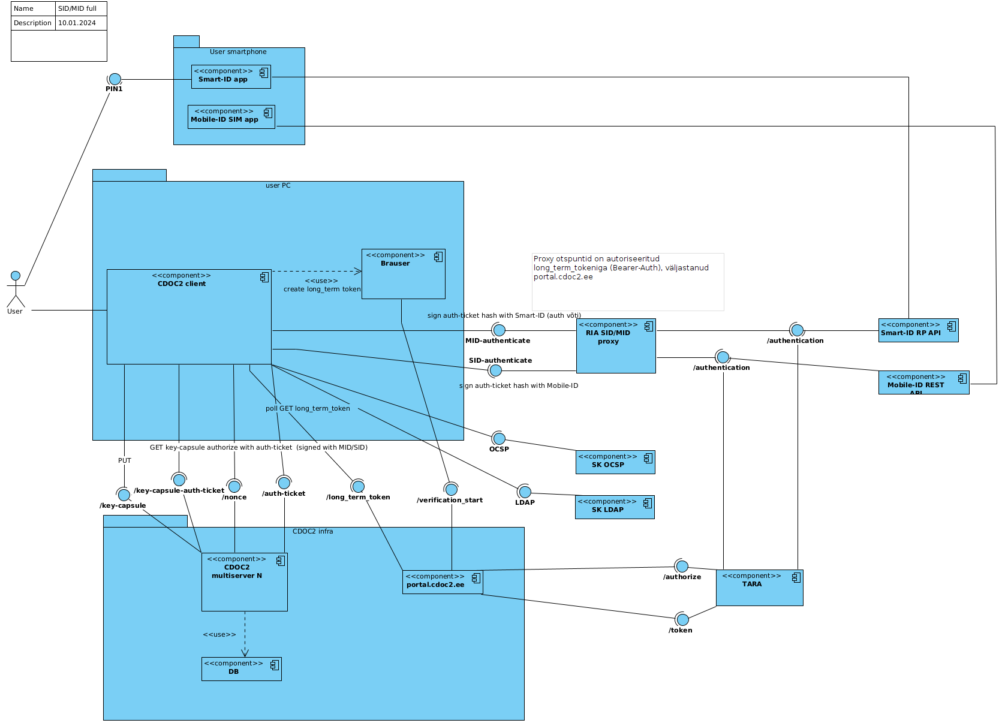

# Encryption/decryption support with Smart-ID/Mob-ID in CDOC2

## Authentication for CDOC2 server API (long-term token creation) using TARA

To access `/secret-share` related endpoints client needs to create long-term token using TARA.

1. TODO

### Test MD

* [link to image](#figure-1)
* [link to line 22](#kek22)

## Draft: Support for encryption/decryption with Smart-ID(/Mobile-ID) in CDOC2

Smart-ID/Mobile-ID support authentication and signatures. Encrypting is not directly supported.
Smart-ID provides REST API that allows relaying-party (cdoc2 client) to ask end users to perform 
authentication and signing operations.

Prerequisites:
* CDOC2 end user has created long-term token to use CDOC2 API.
* CDOC2 client has configuration for N CDOC2 servers used to upload KEK shares.
* CDOC2 client has configuration for t - number of shares out of N required to combine full secret.

Scheme:

1. Sender checks that SID/MID certificate exists for recipient in SK LDAP server.
2. Sender generates `secret` (symmetric key) and `salt` using secure random. 
   key_label value will be: etsi/${etsi_identifier} 
   
   _JK: MID uses additionally mobile phone, but
   this can be asked from user, when decrypting. Later private identifiers could also be supported_
3. Sender [derives key encryption key (KEK)](https://github.com/open-eid/cdoc2-java-ref-impl/blob/main/cdoc20-lib/src/main/java/ee/cyber/cdoc20/crypto/Crypto.java#L121) 
   from `secret`, `key_label` and `salt` using HKDF algorithm
4. Sender [generates file master key (FMK)](https://github.com/open-eid/cdoc2-java-ref-impl/blob/main/cdoc20-lib/src/main/java/ee/cyber/cdoc20/crypto/Crypto.java#L94) 
   (FMK) using HKDF extract algorithm
5. Sender derives content encryption key (CEK) and hmac key (HHK) from FMK using HKDF expand algorithm
6. Sender encrypts FMK with KEK (xor) and gets encrypted_FMK
7. Sender splits `secret` into `N` shares using Shamir Shared Secret Scheme. N is configuration option in CDOC2 client configuration. TODO: SSSS needs analysis [#RM-55926](https://rm-int.cyber.ee/ito/issues/55926)
8. Sender uploads each `secret share` and recipient `etsi_identifier` to each CDOC2 server 
   (each CDOC2 server will receive a different share). CDOC2 servers are configured in client configuration.
   Sender gets `transactionID` for each share. [^1] FBS and OAS
9. Sender adds `encrypted FMK`, `salt`, `key_label` and `server:transactionId` pairs into CDOC2 header. [FBS](https://gitlab.cyber.ee/cdoc-2.0/cdoc20_java/-/blob/RM-55885/cdoc20-schema/src/main/fbs/recipients.fbs#L70) 
   
   _JK:In current FBS and OAS spec, instead of server:transactionId pair, 
   `secret shares` are identified by full urls. That way there is no need to keep synced list of server_name, server_url in client configuration._  

10. Sender calculates header hmac using hmac key (HHK) and adds calculated hmac to CDoc
11. Sender encrypts content with CEK (ChaCha20-Poly1305 with AAD)
12. Sender sends CDOC2 document to Recipient

13. Recipient  will enter her _isikukood_ (id-code) and choose Smart-ID decryption method.
14. Recipient searches CDOC header for Smart-ID record with entered id-code.
15. Recipient downloads Smart-ID certificate from SK LDAP using his id (isikukood).
16. ~~Recipient verifies that certificate serial from LDAP matches with certificate serial from CDOC SID recipient record.~~
17. Recipient loops over secret shares and for each `server:transactionId` asks `nonce` from server. 
    Uses '/secret-shares/{transactionId}/nonce' endpoint in each server. 
     
    
18. Recipient creates [signed part of authentication_ticket](https://gitlab.cyber.ee/id/ee-ria/ria_tender_test_assignment_2023/-/blob/master/exercise-2.3-authentication-multi-server/multi-server-auth-protocol.md?ref_type=heads#allkirjastatavate-andmete-koostamine)
    that includes transaction_id and SHA256(nonce) pairs from all servers
    and signs it with Smart-ID RP-API v2 [/authentication](https://github.com/SK-EID/smart-id-documentation/blob/v2/README.md#239-authentication-session)
    endpoint. `hash` parameter is `SHA256(authentication_ticket)`.
19. Recipient will create [authentication ticket](https://gitlab.cyber.ee/id/ee-ria/ria_tender_test_assignment_2023/-/blob/master/exercise-2.3-authentication-multi-server/multi-server-auth-protocol.md?ref_type=heads#autentimispiletite-koostamine) 
    for each CDOC2 server and download matching secret share. CDOC2 server `GET /secret-share/${transactionId}` endpoint
20. Recipient combines 'secret' shares into full secret (symmetric key) using Shamir Shared Secret Scheme. TODO: SSSS needs analysis [#RM-55926](https://rm-int.cyber.ee/ito/issues/55926)
21. Recipient [derives key encryption key (KEK)](https://github.com/open-eid/cdoc2-java-ref-impl/blob/main/cdoc20-lib/src/main/java/ee/cyber/cdoc20/crypto/Crypto.java#L121)
     from secret, key_label and salt using HKDF algorithm
22. Recipient decrypts FMK using KEK. {#kek22} 
23. Recipient derives CEK and HHK from FMK using HKDF algorithm
24. Recipient calculates hmac and checks it against hmac in CDOC2 header
25. Recipient decrypts content using CEK

## Components

 

### CDOC2 client

Software (cdoc2-java-ref-impl, DigiDoc4 Client) running on user (sender or receiver) device that can create/decrypt 
documents in CDOC2 format.

For encryption generates encryption/decryption key material and distributes it between CDOC2 multi-server 
instances. 

For decryption creates auth-ticket for key material download from multi-server instances. Uses 
Smart-ID/Mobile-ID `/authentication` endpoint to sign auth-ticket.  

### CDOC2 multi-server

Stores encryption/decryption key material. Provides endpoints for auth-ticket creation and 
key material upload/download. For SID/MID use cases key material is distributed
between multiple CDOC2 servers instances, so that compromising one server doesn't expose key material. 
Instances run on independent premises.

[Authentication ticket creation](https://gitlab.cyber.ee/id/ee-ria/ria_tender_test_assignment_2023/-/blob/master/exercise-2.3-authentication-multi-server/multi-server-auth-protocol.md?ref_type=heads#nonsside-v%C3%A4ljastamise-p%C3%A4ringud)

#### Endpoints

WIP: https://gitlab.cyber.ee/cdoc-2.0/cdoc20_java/-/merge_requests/58/diffs

* [/secret-shares](https://gitlab.cyber.ee/cdoc-2.0/cdoc20_java/-/blob/RM-55885/cdoc20-openapi/cdoc20-key-capsules.yaml?ref_type=heads#L102) Upload Shamir Secret Share and get transactionId
* [/secret-shares/{transactionId}/nonce](https://gitlab.cyber.ee/cdoc-2.0/cdoc20_java/-/blob/RM-55885/cdoc20-openapi/cdoc20-key-capsules.yaml?ref_type=heads#L127) Create nonce for transactionId (for authentication)
* [/secret-shares/{transactionId}](https://gitlab.cyber.ee/cdoc-2.0/cdoc20_java/-/blob/RM-55885/cdoc20-openapi/cdoc20-key-capsules.yaml?ref_type=heads#L71) GET Shamir Secret Share for transactionId

Old endpoints from test assignment:
* ~~[/nonce](https://gitlab.cyber.ee/id/ee-ria/cdoc2-java-ref-impl/-/blob/main/cdoc20-openapi/cdoc20-key-capsules.yaml?ref_type=heads#L71)
  Create server nonce for authentication signature~~
* ~~[/auth-ticket](https://gitlab.cyber.ee/id/ee-ria/cdoc2-java-ref-impl/-/blob/main/cdoc20-openapi/cdoc20-key-capsules.yaml?ref_type=heads#L96)
  Verify auth ticket. TODO: In future endpoint allows to download KeyCapsule share~~

### Smart-ID app

Enables to authenticate and sign using Smart-ID. Installed on user smartphone.

### portal.cdoc2.ee

Web service to generate CDOC2 server and RIA proxy authentication long-term tickets. 
Long-term authentication tickets are one-time, created once after installing CDOC2 client software. 
Long-term tickets are used to access API only (Bearer-Auth HTTP header), not used for key-material 
retrieval. Uses TARA OpenID Connect to authenticate. 

### RIA SID/MID proxy

Exposes same endpoints as Smart-ID RP API or Mobile-ID REST API, but allows API access without 
authentication (without setting `relyingPartyUUID` and `relyingPartyName`).

### Smart-ID RP API v2

Relaying Party API is used to start authentication with Smart-ID

#### Endpoints
* [/authentication](https://github.com/SK-EID/smart-id-documentation/blob/v2/README.md#239-authentication-session)
  Starts authentication with Smart-ID
* [/session](https://github.com/SK-EID/smart-id-documentation/blob/v2/README.md#2311-session-status)
  Poll authentication status

### TARA

OpenID Connect for E-ID supported methods (Smart-ID/Mobile-ID/id-card)

#### Endpoints 
Authentication request
[/authorize](https://e-gov.github.io/TARA-Doku/TechnicalSpecification#41-authentication-request)

## Links

* [1] Flatbuffers and OpenAPI spec WIP: https://gitlab.cyber.ee/cdoc-2.0/cdoc20_java/-/merge_requests/58/diffs