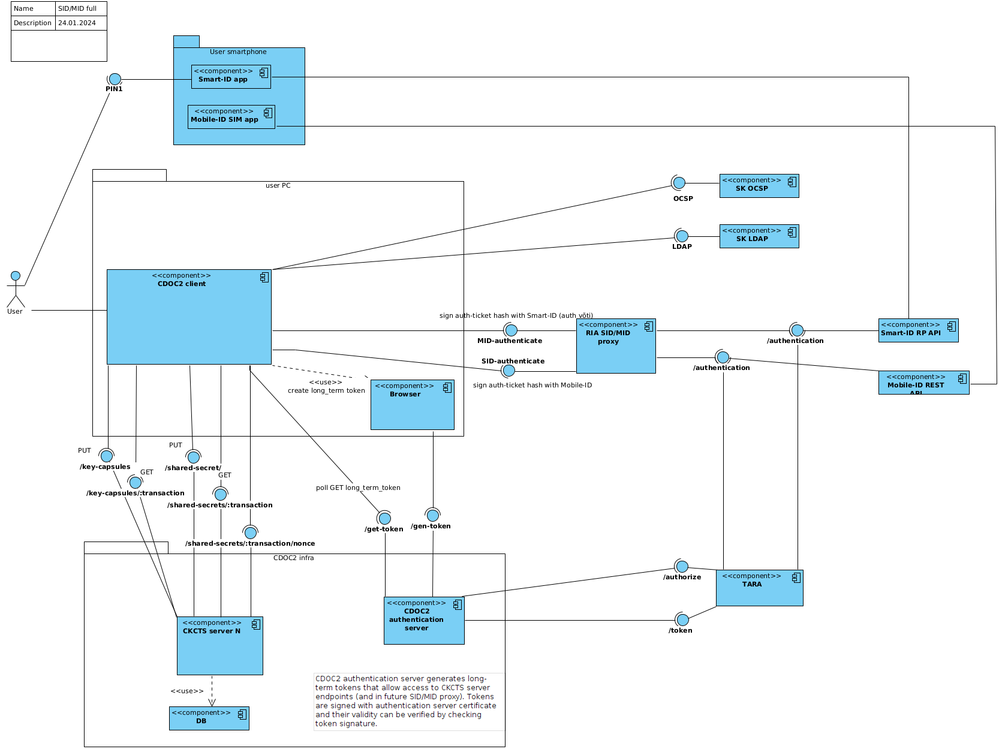

## Components

### CDOC2 client

Software (java-ref-impl, DD4, MOPP) running on user (sender or receiver) device that can create/decrypt 
documents in CDOC2 format.

For encryption generates encryption/decryption key material and distributes it between CDOC2 multi-server 
instances. 

For decryption creates auth-ticket for key material download from multi-server instances. Uses 
Smart-ID/Mobile-ID `/authentication` endpoint to sign auth-ticket.  

### CDOC2 multi-server

Stores encryption/decryption key material. Provides endpoints for auth-ticket creation and 
key material upload/download. For SID/MID use cases key material is distributed
between multiple CDOC2 servers instances, so that compromising one server doesn't expose key material. 
Instances run on independent premises.

[Authentication ticket creation](https://gitlab.cyber.ee/id/ee-ria/ria_tender_test_assignment_2023/-/blob/master/exercise-2.3-authentication-multi-server/multi-server-auth-protocol.md?ref_type=heads#nonsside-v%C3%A4ljastamise-p%C3%A4ringud)

#### Endpoints

* [/nonce](https://gitlab.cyber.ee/id/ee-ria/cdoc2-java-ref-impl/-/blob/main/cdoc20-openapi/cdoc20-key-capsules.yaml?ref_type=heads#L71)
  Create server nonce for authentication signature
* [/auth-ticket](https://gitlab.cyber.ee/id/ee-ria/cdoc2-java-ref-impl/-/blob/main/cdoc20-openapi/cdoc20-key-capsules.yaml?ref_type=heads#L96)
  Verify auth ticket. TODO: In future endpoint allows to download KeyCapsule share

### Smart-ID app

Enables to authenticate and sign using Smart-ID. Installed on user smartphone.

### portal.cdoc2.ee

Web service to generate CDOC2 server and RIA proxy authentication long-term tickets. 
Long-term authentication tickets are one-time, created once after installing CDOC2 client software. 
Long-term tickets are used to access API only (Bearer-Auth HTTP header), not used for key-material 
retrieval. Uses TARA OpenID Connect to authenticate. 

### RIA SID/MID proxy

Exposes same endpoints as Smart-ID RP API or Mobile-ID REST API, but allows API access without 
authentication (without setting `relyingPartyUUID` and `relyingPartyName`).

### Smart-ID RP API v2

Relaying Party API is used to start authentication with Smart-ID

#### Endpoints
* [/authentication](https://github.com/SK-EID/smart-id-documentation/blob/v2/README.md#239-authentication-session)
  Starts authentication with Smart-ID
* [/session](https://github.com/SK-EID/smart-id-documentation/blob/v2/README.md#2311-session-status)
  Poll authentication status

### TARA

OpenID Connect for E-ID supported methods (Smart-ID/Mobile-ID/id-card)

#### Endpoints 
Authentication request
[/authorize](https://e-gov.github.io/TARA-Doku/TechnicalSpecification#41-authentication-request)