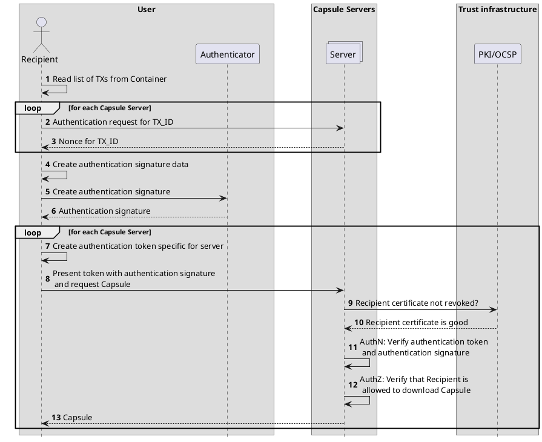

# Authentication protocol

This section defines protocol for authenticating to CDOC2 Capsule Server (herein also simply ‘the server’) in order to download Capsules from the server.

## Server operating principles

In the simplest case, the server operates as follows.

1. The sender generates a Capsule for a specific recipient during encryption.
2. The sender chooses a Capsule Server, connects to the server and transmits the Capsule to the server along with a recipient identifier.
3. The server generates a transaction identifier and saves the generated identifier along with the Capsule and recipient identifier.
4. The sender adds the selected server’s identifier, transaction identifier, and recipient identifier to the container.
5. The sender transmits the container to the recipient.
6. The recipient finds information concerning the Capsule generated for them in the container.
7. The recipient connects to the server chosen by the sender and authenticates with the server.
8. The recipient transmits the transaction identifier found in the container to the server.
9. The server looks up the Capsule based on the transaction identifier and the recipient identifier established during authentication.
10. The server returns the Capsule to the recipient.
11. The recipient uses the information found in the Capsule for decrypting the container.

Recipient steps for downloading the Capsule information from servers is displayed in sequence diagram below:



## Recipient authentication

Each Capsule Server-based Capsule type describes a specific recipient identification and authentication method.
This version of the specification defines one Capsule Server-based Capsule type: `KeyServerCapsule`.

This list may be expanded in future versions of the specification. Various authentication schemes may be used in parallel.

### The `KeyServerCapsule` authentication scheme

In this scheme, the recipient is identified by their public key used for the decryption of the container. The public key is defined by the field `RecipientKey` in the structure `KeyServerCapsule`.

The server authenticates the recipient using TLS client authentication (*mTLS*). The server is configured to validate the client certificate (e.g. using OSCP). Should the recipient lose control of their decryption key and cancel their certificate, the Capsule Server will not issue the Capsule card to the new holder (attacker) and the attacker will be unable to decrypt the container.

After successful authentication, the server reads the client’s public key from the certificate used by the client and compares this public key to the public key tied to the Capsule referenced by the transaction identifier. If the two keys match, the server will return the Capsule. Otherwise, the server will return an error message.

### The `SDJWT` authentication scheme

TODO: describe how to use SD-JWT.

## Authentication

We need to do detached JWS? No, not really. We could include all the payload in the signature object. Even if the server has everything, it's still ok.

### Authentication signature

```json
{
    "type": "CDOC2 authentication signature v0.1",
    "nonces": [
        {
            "transactionID": "transactionID1",
            "masked_nonce": "SHA-256(nonce1)"
        },
        {
            "transactionID": "transactionID2",
            "masked_nonce": "SHA-256(nonce2)"
        },
        {
            "transactionID": "transactionID3",
            "masked_nonce": "SHA-256(nonce3)"
        }
    ]
}
```

#### ID-card-raw

We will create JWS object with header:

```json
{
    "typ": "JWS",
    "alg": "RS256"
}
```

and with payload:

```java
BASE64URL(JWS Header)..BASE64URL(JWS Signature)
```

```json
{
    "type": "CDOC2 authentication signature v0.1",
    "nonces": [
        {
            "transactionID": "transactionID1",
            "masked_nonce": "SHA-256(nonce1)"
        },
        {
            "transactionID": "transactionID2",
            "masked_nonce": "SHA-256(nonce2)"
        },
        {
            "transactionID": "transactionID3",
            "masked_nonce": "SHA-256(nonce3)"
        }
    ]
}
```

### Authentication token

```json
{
    "type": "CDOC2 authentication ticket v0.1",
    "transaction": {
            "transactionID": "transactionID1",
            "nonce": "nonce1"
    },
    "masked_transactions": [
        {
            "transactionID": "transactionID2",
            "masked_nonce": "SHA-256(nonce2)"
        },
        {
            "transactionID": "transactionID3",
            "masked_nonce": "SHA-256(nonce3)"
        }
    ],
    "authentication_signature_type": "ID-card-raw",
    "authentication_signature_value": "signature",
    "jwk": "certificate that corresponds to the key used to
        create the authentication signature, in JSON Web Key format"
}
```

## MID/SID authentication scheme for N-of-N

We might use https://www.ietf.org/archive/id/draft-ietf-oauth-selective-disclosure-jwt-08.txt data format with following changes in concepts

1. CDOC2 Client is the SD-JWT Issuer + Holder
2. CDOC2 Server is the SD-JWT Verifier
3. CDOC2 Client gets nonce1, nonce2, nonce3 from server1, server2, server3.
4. CDOC2 Client creates a set of JWT claims like ("CapsuleId1": "nonce1")
5. CDOC2 Client issues SD-JWT with signing it with ephemeral issuer key pair
6. CDOC2 Client creates three presentations of SD-JWT to different servers. Each time, it discloses only those claims, which are relevant for particular server, i.e. only "CapsuleId1": "nonce1" and not "CapsuleId2: "nonce2".
7. CDOC2 Server receive a presentation with only relevant data and cannot replay it to other servers.

PoC script: cdoc2-sd-jwt-testing.py in root of this repo.

TODO problems:

1. Smart-ID RP-APIv3 authentication method doesn't sign the hash given by RP, but modifies it. This might mean that we have to use custom JWT/JWS verifier.
2. SD-JWT presentation also needs a "nonce". This is different from n1, n2, n3 and it gets confusing.
3. ...

(perhaps we can do a "deterministic" nonce, with hash from some known value to client and every server?)
