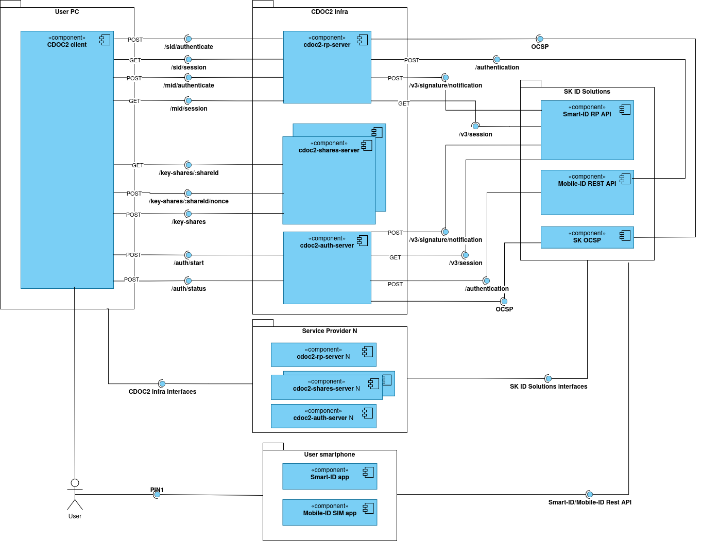

# System Context -  SID/MID

"CDOC2 system" is a system containing two distinct operational contexts. This page describes the SID/MID context; for the Hardware Token/Capsule Server context, see [Hardware Token/Capsule Server](ch01_system_context.md). Both contexts share the CDOC2 reference library and CDOC2 CLI client as common components.

> **Note:** DigiDoc4 is the primary end-user client application through which
> most users interact with CDOC2. However, DigiDoc4 is not part of the CDOC2
> system scope defined here, as its architecture and documentation are
> maintained separately.

## Overview

This context covers encryption and decryption flows where the Recipient authenticates using Smart-ID or Mobile-ID and key material is split into
Key Shares distributed across multiple CDOC2 Shares Servers.

Primary components:

1. CDOC2 Capsule Server (CCS): stores Server Capsules and mediates them between Sender and Recipient, used by CDOC2 clients such as the reference CLI client and DigiDoc4. Every CDOC2 Capsule Server uses a local database component as well.
2. CDOC2 Shares Server (CSS): stores Key Shares and mediates them between Sender and Recipient, used by CDOC2 clients such as the reference CLI client and DigiDoc4. Every CDOC2 Shares Server uses a local database component as well.
3. CDOC2 Authentication Server (cdoc2-auth-server): used in SID/MID authentication flows only. Composes and issues Session Tokens that are included as headers in subsequent requests to other CDOC2 infrastructure components. Has a local database component.
4. CDOC2 Relying Party Server (cdoc2-rp-server): mediates and validates client requests to the SID/MID relying party API, including verifying the Session Token issued by the Authentication Server. Has a local database component.
5. CDOC2 Reference Library: used by CDOC2 servers and the CLI client.
6. CDOC2 CLI Client: a command-line Java application that implements all CDOC2 end-user use cases, but without graphical user interface.

## External Systems

The CDOC2 system depends on the following external components and services. 
See [External Interfaces](ch03_external_interfaces.md) for API details and endpoints. 

1. Smart-ID RP API (SK ID Solutions), which the CDOC2 RP Server connects to for Smart-ID authentication sessions using protocol ACSP_V2.
2. Mobile-ID REST API (SK ID Solutions), which the CDOC2 RP Server connects to for Mobile-ID authentication sessions.
3. OCSP servers (SK ID Solutions, Zetes), which provide certificate validity checking for ID-card/MID/SID certificates.
4. LDAP servers (SK ID Solutions, Zetes), which are used by CDOC2 client applications to search for Recipient certificates.
