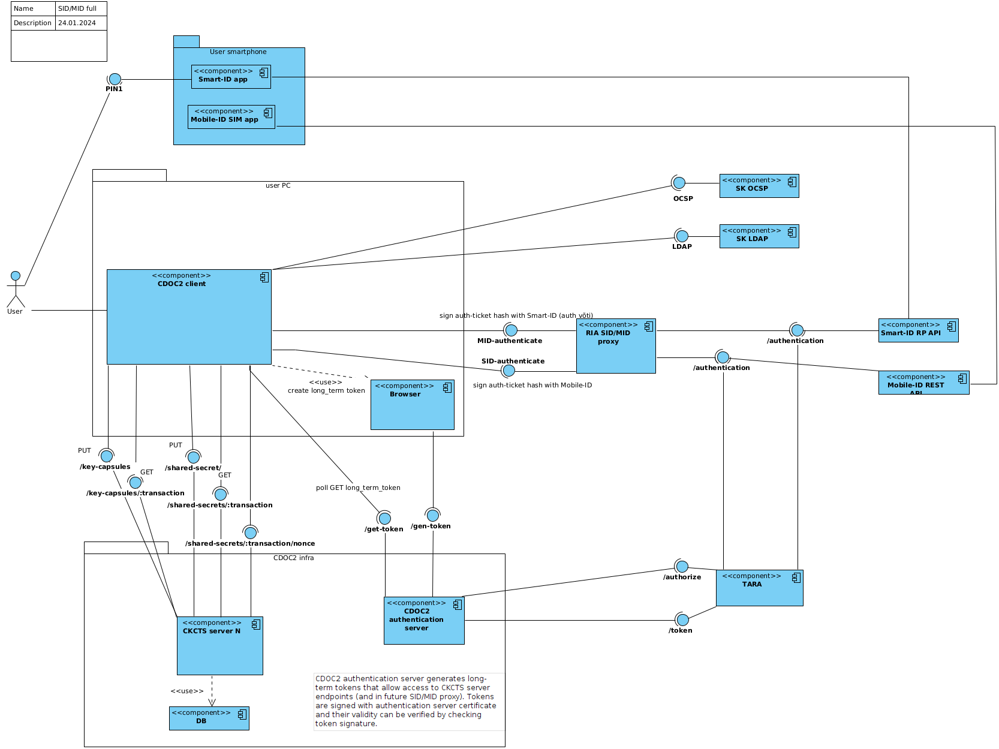

# System Context

## Overview

"CDOC2 system" - IT system, which contains following primary components:

1. CDOC2 Capsule Server (CCS) to be used by CDOC2 clients, such as reference CLI client and DigiDoc4 client application. Every CDOC2 Capsule Server uses local database component as well.
2. CDOC2 Shares Server (CSS) to be used by CDOC2 clients, such as reference CLI client and DigiDoc4 client application. Every CDOC2 Shares Server uses local database component as well.
3. CDOC2 reference library, to be used by CDOC2 servers, CLI client.
4. CDOC2 CLI client, which is a command-line Java application and which implements all CDOC2 end-user use cases, but without graphical user interface.

DigiDoc4 client application is not in the scope of CDOC2 system, even though, it is the main client application, through which the end-user actually uses the system use-cases.

## External Systems

There are other components, which are supporting CDOC2 system in some way:

1. CDOC2 authentication portal, which issues long term access tokens to MID/SID proxy.
2. MID/SID authentication services proxy, which relays the MID/SID authentication requests to actual Mobile-ID/Smart-ID RP-API services.
TARA, which is an EE government provided central authentication service, used by CDOC2 authentication portal
3. OCSP and LDAP services, which provide ID-card/MID/SID certificate validity and certificate search services.
