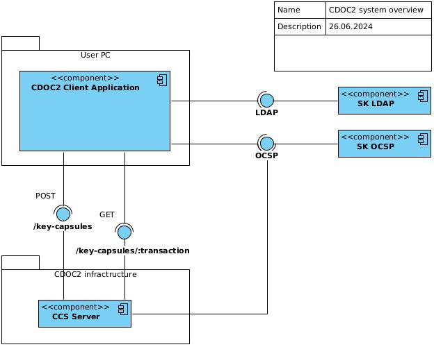

# System Context

## Overview

"CDOC2 system" - IT system, which contains following primary components:

1. CDOC2 Capsule Server (CCS) to be used by CDOC2 clients, such as reference CLI client and DigiDoc4 client application. Every CDOC2 Capsule Server uses local database component as well.
2. CDOC2 reference library, to be used by CDOC2 servers.
3. CDOC2 CLI reference client, which is a command-line Java application which implements all CDOC2 end-user usecases, but without graphical user interface.

DigiDoc4 client application is not in the scope of CDOC2 system, even though, it is the main client application, through which the end-user actually participates in the system use cases.

## External Systems

There are other components, which are supporting CDOC2 system in some way:

1. OCSP and LDAP services, which provide ID-card certificate validity and certificate search services.
