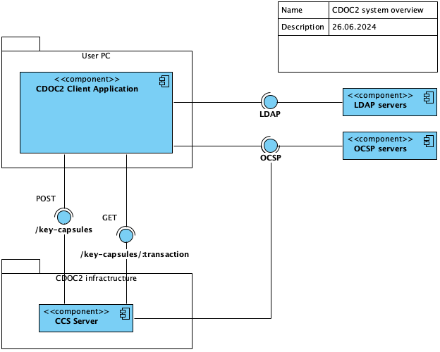

# System Context -  Hardware Token/Capsule Server

"CDOC2 system" is a system containing two distinct operational contexts.  This page describes the Hardware Token/Capsule Server context; for the Smart-ID/Mobile-ID context, see [SID/MID](ch001_system_context_sid_mid.md). Both contexts share the CDOC2 reference library and CDOC2 CLI client as common components.

> **Note:** DigiDoc4 is the primary end-user client application through which
> most users interact with CDOC2. However, DigiDoc4 is not part of the CDOC2
> system scope defined here, as its architecture and documentation are
> maintained separately.

## Overview

This context covers encryption and decryption flows where the Recipient holds
a hardware security token (e.g. an Estonian ID-card) and key material is
mediated via a CDOC2 Capsule Server.

Primary components:

1. CDOC2 Capsule Server (CCS): stores Server Capsules and mediates them between Sender and Recipient, used by CDOC2 clients such as the reference CLI client and DigiDoc4. Every CDOC2 Capsule Server uses a local database component as well.
2. CDOC2 Reference Library: used by CDOC2 servers and the CLI client.
3. CDOC2 CLI Client: a command-line Java application that implements all CDOC2 end-user use cases, but without a graphical user interface.

## External Systems

The CDOC2 system depends on the following external components and services. 

1. OCSP servers (SK ID Solutions, Zetes), which provide certificate validity checking for ID-card certificates.
2. LDAP servers (SK ID Solutions, Zetes), which are used by CDOC2 client applications to search for Recipient certificates.
