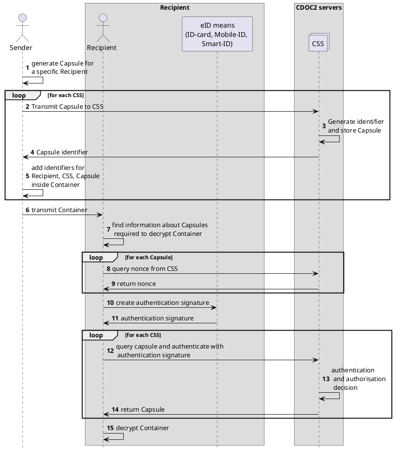

# CDOC2 CCS

This section defines the CDOC2 CCS (CCS, herein also simply ‘the server’), what interfaces it provides to other system components and rules of use.

## Introduction

The CCS is a subsystem tasked with transmitting the Capsule required for the decryption of the CDOC2 Container from the sender to the recipient following the rules set out for specific encryption methods in section [CDOC2 encryption schemes](../02_protocol_and_cryptography_spec/ch02_encryption_schemes.md#cdoc2-encryption-schemes). In some cases the encryption schemes use single CCS and in some cases, encryption schemes use multiple CCSs, which are independent and operated by separate organizations.

The communication channel provided by the CCS (or multiple CCSs) is more secure than public channels of communication used for the transmission of CDOC2 Containers. A properly operating CCS ensures that the attacker, who is monitoring the public communication channel and may store all CDOC2 Containers and may be able to break public key encryption algorithms in the future with sufficiently powerful quantum computer, is not able to do so, because the Capsule information is transmitted in a separate channel. Thus the CDOC2 System gains some additional protection against quantum computers. The CCS does not need to transmit large encrypted documents, meaning that its operating costs will be low.

Multiple CCSs may be used in parallel, operated by different organizations. Security requirements established in the implementation process may call for the operation of each individual CCS by organizations, that are independent from each other.

## CCS operating principles

In the simplest case, the CCS operates as follows.

1. Sender generates a Capsule for a specific Recipient during encryption.
2. Sender chooses a CCS, connects to the server and transmits the Capsule to the server along with a Recipient identifier.
3. CCS generates a transaction identifier and saves the generated identifier along with the Capsule and Recipient identifier.
4. CSS returns the generated identifier to Sender
5. Sender adds selected CCS identifier, transaction identifier, and Recipient identifier inside Container.
6. The Sender transmits Container to Recipient.
7. The Recipient finds information concerning the Capsule generated for them in Container.
8. The Recipient queries nonce from CCS.
9. CCS returns nonce.
10. Recipient uses eID means to create authentication signature.
11. eID means returns the authentication signature.
12. Recipient authenticates to CCS and queries capsule.
13. CCS looks up Capsule based on the transaction identifier and verifies the authentication signature and makes authentication decision and access control decision.
14. CCS returns Capsule to Recipient.
15. Recipient uses the information found in Capsule for decrypting Container.

## Server state

Server state consists of the Capsules received by the server for transmission, as well as all relevant information.

- Capsule: Byte array, meaningless for the server.
- Transaction ID: UUID generated by the server itself using a cryptographically secure random number generator.
- Recipient ID: Identifier received by the server as the output of the recipient authentication process.
- Validity period: The CSS stores the Capsule only for a limited period, collectively specified by the sender and the key management policies used by the CSS. The capsule is deleted after this period.

## Server interfaces

The server provides two interfaces: one for delivery of the Capsule from the sender to the CSS and the other for delivery of the Capsule from the server to the recipient.

The interfaces are formally described in the [OpenAPI format](https://spec.openapis.org/oas/latest.html) (see [appendix C](../02_protocol_and_cryptography_spec/appendix_c_cdoc2-capsules.md)).

### Sender interface

The CSS sender interface is used by the sender to transmit the Capsule to the server and receive a transaction identifier that they will subsequently add to the container header.

The sender transmits the Capsule and recipient identifier to the server and receives from the server a transaction identifier.
The interface is unauthenticated and can be used by all senders.

### Recipient interface

The CSS recipient interface is used by the recipient to receive a Capsule from the server.

The recipient authenticates with the server and transmits a transaction identifier. Based on this identifier, the server looks up the Capsule. The capsule must be addressed to the recipient who authenticated with the server – the server thus compares the recipient identifier established during authentication with the recipient identifier transmitted by the sender of the Capsule. The server then returns the Capsule to the recipient.

### Interface security

Interface security is ensured using the TLS 1.3 protocol. The server holds a certificate issued by a publicly available and trusted CA. The clients can validate this certificate on each connection using the OCSP protocol.

To ensure protocol security, it is important to make sure that the Capsule is only received by the CSS. This can be achieved via the pinning of server TSL keys. Key pinning ensures that commonly practiced1 use of TLS inspection does not compromise the confidentiality of the keying material.

## Server identification and trust

Enhanced security features provided by CDOC2 are only valid if the Capsule is transmitted via servers meeting the requirements of the specific encryption scenario (see section [02_protocol_and_cryptography_spec/ch02_encryption_schemes.md]).

To ensure the recipient and sender’s confidence in the servers they are using, each client using the CDOC2 format must be provided with a list of trusted CSSs either as a part of the DigiDoc software package or in some other form. This list is also used for TLS key pinning.

The server list consists of the following elements.

- Server identifier
- Capsule type supported by the server.
- Sender interface URL.
- Recipient interface URL.
- Identifier of the organization maintaining the server.
- Server public keys to enable the client to cryptographically verify the server’s identity. Public keys are provided in the form of certificates.

The sender never transmits the recipient the server’s technical access point but only its identifier in the server list. This is done to prevent attacks seeking mislead the recipient into communicating with an untrusted server.

Should multiple independent CSS infrastructures be set up with no coordination of server identifier assignation between the systems and should the same identifier be assigned to different servers in different systems, this could lead to a situation where a client using the infrastructure of one system creates a container that another client will then attempt to open using the infrastructure of another system.

This would result in the recipient contacting the wrong CSS, authenticating with the server, and transmitting the transaction identifier found in the container to the server. The server will be unable to find the Capsule corresponding to this transaction identifier and will return an error message (Decryption failed).

The CSS used by the recipient will receive a transaction identifier but since it will be unable to authenticate with the correct CSS on the behalf of the recipient, it will also be unable to download the Capsule from the correct server.

The Capsule type supported by the server allows the sender to choose the correct Capsule type and enables the recipient to authenticate with the server using the correct protocol. As the servers are lightweight, an organization seeking to support multiple different recipient types will be able to run multiple separate CSSs. This ensures that the CSSs can be simplified and thus made more secure. This is especially important in the case of the recipient interface, as the authentication protocols used may widely differ in their features, making secure implementation difficult.

The identifier of the organization maintaining the server does not necessarily have to be explicitly tied to the organization’s name, but it must enable the identification of servers controlled by the same organization. This information is required to support future secret sharing-based encryption methods.

Each server may be assigned more than one public key – this helps ensure smooth change of certificates and keys. Upon connection to the server, the client must always verify that the server is using one of the listed certificates. This will help prevent man-in-the-middle attacks.

## Recipient authentication

Each CSS-based Capsule type describes a specific recipient identification and authentication method.
This version of the specification defines two CSS-based Capsule types:

1. ``KeyServerCapsule`` -- public key based authentication and access control
2. ``KeySharesCapsule`` -- national identity code based authentication and access control

This list may be expanded in future versions of the specification. Various authentication schemes may be used in parallel.

### The ``KeyServerCapsule`` authentication scheme

In this scheme, the recipient is identified by their public key used for the decryption of the container. The public key is defined by the field ``RecipientKey`` in the structure ``KeyServerCapsule``.

The server authenticates the recipient using TLS client authentication (*mTLS*). The server is configured to validate the client certificate (e.g. using OSCP). Should the recipient lose control of their decryption key and cancel their certificate, the CSS will not issue the Capsule card to the new holder (potential attacker) and the attacker will be unable to decrypt the container.

After successful authentication, the server reads the client’s public key from the certificate used by the client and compares this public key to the public key tied to the Capsule referenced by the transaction identifier. If the two keys match, the server will return the Capsule. Otherwise, the server will return an error message.

### The ``KeySharesCapsule`` authentication scheme

In this scheme, the recipient is identified by the national identity code (*isikukood*). Identity code of the recipient is defined by the field ``recipient_id`` in the structure ``KeySharesCapsule``.

The server authenticates the recipient using a special protocol, as described in section [ID authentication protocol](ch05_ID_authentication_protocol.md).
