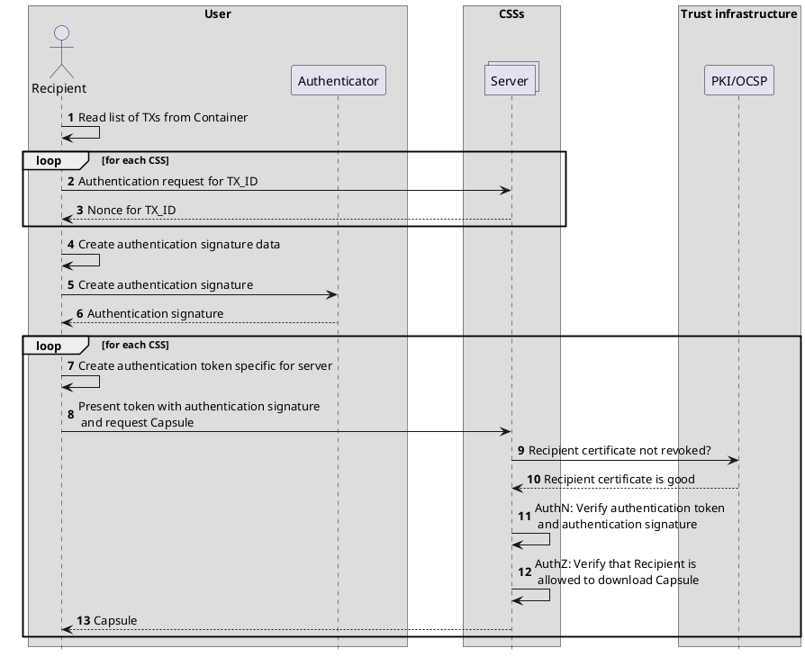

# CDOC2 CSS

This section defines the CDOC2 Shares Server (CSS), what interfaces it provides to other system components, and rules of use.

## Introduction

The CSS is a subsystem tasked with transmitting the Shares Capsule required for the decryption of the CDOC2 Container from the sender to the recipient following the rules set out for specific encryption methods in section [CDOC2 encryption schemes](../02_protocol_and_cryptography_spec/ch02_encryption_schemes.md#cdoc2-encryption-schemes). It must use encryption schemes with multiple CSSs, which are independent and operated by separate organizations.

The communication channel provided by multiple CSSs is more secure than public channels of communication used for the transmission of CDOC2 Containers. A properly operating CSS ensures that the attacker, who is monitoring the public communication channel and may store all CDOC2 Containers and may be able to break public key encryption algorithms in the future with sufficiently powerful quantum computer, is not able to do so, because the Shares Capsule information is transmitted in a separate channel. Thus, the CDOC2 System gains some additional protection against quantum computers. The CSS does not need to transmit large encrypted documents, meaning that its operating costs will be low.

Multiple CSSs have to be used in parallel, operated by different organizations. Security requirements established in the implementation process may call for the operation of each individual CSS by organizations, that are independent of each other.

## CSS operating principles

In the simplest case, the CSS operates as follows.

1. The Sender generates a Shares Capsule for a specific Recipient during encryption.
2. The Sender chooses the CSS servers, connects to the servers and transmits the Shares Capsules to the servers along with a Recipient identifier.
3. Each CSS generates a share identifier and saves the generated identifier along with the Capsule and Recipient identifier.
4. The sender adds the selected servers' identifiers, share identifiers, and recipient identifier to the container.
5. The sender transmits the container to the recipient.
6. The recipient finds information concerning the Shares Capsule generated for them in the container.
7. The recipient connects to each CSS server chosen by the sender and authenticates with the servers (by signing authentication tokens).
8. The recipient transmits the share identifier found in the container to the servers.
9. Each CSS server looks up the Shares Capsule based on the share identifier and the recipient identifier established during authentication.
10. Each server returns the Shares Capsule to the recipient.
11. The recipient combines all the Shares Capsules to reconstruct the key material for decrypting the container.

TODO: this diagram doesn't match the steps yet.

## Server state

Server state consists of the Capsule received by the server for transmission, as well as all relevant information.

- Capsule: Byte array, meaningless for the server.
- Share ID: UUID generated by the server itself using a cryptographically secure random number generator.
- Recipient ID: Identifier received by the server as the output of the recipient authentication process.

## Server interfaces

The server provides two interfaces: one for delivery of the Shares Capsule from the sender to the CSS and the other for delivery of the Shares Capsule from the server to the recipient.

The interfaces are formally described in the [OpenAPI format](https://spec.openapis.org/oas/latest.html) (see [appendix C](../02_protocol_and_cryptography_spec/appendix_c_cdoc2-capsules.md)).

### Sender interface

The CSS sender interface is used by the sender to transmit the Shares Capsule to the server and receive a share identifier that they will subsequently add to the container header.

The sender transmits the Shares Capsule and recipient identifier to the server and receives from the server a share identifier.
The interface is unauthenticated and can be used by all senders.

### Recipient interface

The CSS recipient interface is used by the recipient to receive a Shares Capsule from the server.

The recipient authenticates with the servers and transmits a share identifier to each server. Based on this identifier, the server looks up the Capsule. The Shares Capsule must be addressed to the recipient who authenticated with the server – the server thus compares the recipient identifier established during authentication with the recipient identifier transmitted by the sender of the Capsule. The server then returns the Shares Capsule to the recipient.

### Interface security

Interface security is ensured using the TLS 1.3 protocol. The server holds a certificate issued by a publicly available and trusted CA. The clients can validate this certificate on each connection using the OCSP protocol.

To ensure protocol security, it is important to make sure that the Shares Capsule is only received by the CSS. This can be achieved via the pinning of server TSL keys. Key pinning ensures that commonly practiced1 use of TLS inspection does not compromise the confidentiality of the keying material.

## Server identification and trust

Enhanced security features provided by CDOC2 are only valid if the Capsules are transmitted via servers meeting the requirements of the specific encryption scenario (see [Server identification and trust](#server-identification-and-trust)).

To ensure the recipient and sender’s confidence in the servers they are using, each client using the CDOC2 format must be provided with a list of trusted CSSs either as a part of the DigiDoc software package (or other client application) or in some other form. This list is also used for TLS key pinning.

The server list consists of the following elements.

- Server identifier
- Capsule type supported by the server.
- Sender interface URL.
- Recipient interface URL.
- Identifier of the organization maintaining the server.
- Server public keys to enable the client to cryptographically verify the server’s identity. Public keys are provided in the form of certificates.

The sender never transmits the recipient the server’s technical access point but only its identifier in the server list. This is done to prevent attacks seeking mislead the recipient into communicating with an untrusted server.

Should multiple independent CSS infrastructures be set up with no coordination of server identifier assignation between the systems and should the same identifier be assigned to different servers in different systems, this could lead to a situation where a client using the infrastructure of one system creates a container that another client will then attempt to open using the infrastructure of another system.

This would result in the recipient contacting the wrong CSS, authenticating with the server, and transmitting the share identifier found in the container to the server. The server will be unable to find the Shares Capsule corresponding to this share identifier and will return an error message (Decryption failed).

The CSS used by the recipient will receive a share identifier but since it will be unable to authenticate with the correct CSS on the behalf of the recipient, it will also be unable to download the Shares Capsule from the correct server.

The Capsule type supported by the server allows the sender to choose the correct Capsule type and enables the recipient to authenticate with the server using the correct protocol. As the servers are lightweight, an organization seeking to support multiple different recipient types will be able to run multiple separate CSSs. This ensures that the CSSs can be simplified and thus made more secure. This is especially important in the case of the recipient interface, as the authentication protocols used may widely differ in their features, making secure implementation difficult.

The identifier of the organization maintaining the server does not necessarily have to be explicitly tied to the organization’s name, but it must enable the identification of servers controlled by the same organization. This information is required to support future secret sharing-based encryption methods.

Each server may be assigned more than one public key – this helps ensure smooth change of certificates and keys. Upon connection to the server, the client must always verify that the server is using one of the listed certificates. This will help prevent man-in-the-middle attacks.

## Recipient authentication

Each CSS-based Capsule type describes a specific recipient identification and authentication method.
This version of the specification defines a single CSS-based Capsule type:

- ``KeySharesCapsule`` -- authentication and access control based on ETSI semantics identifier (national identity code) or private company issuer identifier.

This list may be expanded in future versions of the specification. Various authentication schemes may be used in parallel.

### The ``KeySharesCapsule`` authentication scheme

In this scheme, the recipient is identified by ETSI semantics identifier (national identity code) or private company issuer identifier. The identity code of the recipient is defined by the field ``recipient_id`` in the structure ``KeySharesCapsule``. 

The server authenticates the recipient using a special protocol, as described in section [ID authentication protocol](ch05_ID_authentication_protocol.md).

The two following `recipient_id` naming patters are supported:

**ETSI semantics identifier**:

The identifier must adhere to the following pattern:

- Starts with `etsi/` identifier scheme in order to separate from other identifiers.
- 3 character identity type reference; e.g. `PNO`
- 2 character ISO 3166-1 [2] country code; e.g. `EE`
- hyphen-minus "-" (0x2D (ASCII), U+002D (UTF-8)); and
- identifier (according to country and identity type reference). E.g., in case of personal ID code, just ID code. Maximum length is 20 characters.

All but the `etsi/` prefix are also defined in [ETSI EN 319 412-1, section 5.1.3.](https://www.etsi.org/deliver/etsi_en/319400_319499/31941201/01.04.04_60/en_31941201v010404p.pdf).

Example:

`etsi/PNOEE-48010010101`

**Private company issuer identifier**:

The identifier must adhere to the following pattern:

- Starts with `private/` identifier scheme in order to separate from other identifiers.
- Vendor identifier; e.g. `PAS`
- forward slash "/" (0x2F (ASCII), U+002F (UTF-8)); and
- identifier (up to vendor to define). Maximum length is 20 characters.

Example:

`private/JIO/70000349`