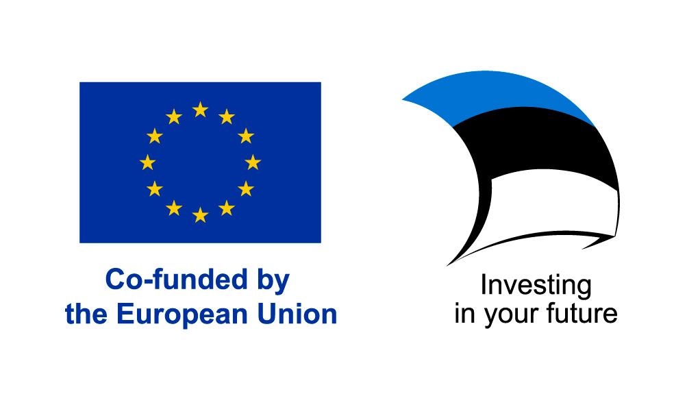

# Introduction

This is documentation for the CDOC2 System and includes analysis, protocol and format specification, architecture documentation.

## Goal

This documentation aims to describe the CDOC2 System.

## Document scope

The specification describes:

* Supported encryption schemes.
* Abstract and serialized data format.
* Details of cryptographic operations.
* Use of a CDOC2 capsule server.
* Implementation guidelines.

## Terms and acronyms

* `CDOC` - Crypto Digidoc, encrypted file transmission format used in the Estonian eID ecosystem

* `CDOC 1.0` - Unofficial term for all (XML-ENC based) CDOC formats preceding this specification.

* `CDOC2 System` - IT system, which allows users to send encrypted files to each other with the help of CDOC2 Client Applications and CDOC2 Capsule Servers

* `CDOC2 Container` - File format for transmitting the encrypted payload and metadata information,  including the capsule from Sender to Recipient

* `Capsule` - Data structure, which contains encryption scheme-specific information (encrypted symmetric keys, public keys, salt, server object references, ...) which Recipient can use to derive, establish or retrieve decryption keys for decrypting the CDOC2 Container. Capsule can either be a Server Capsule or a Container Capsule.

* `Server Capsule` - A Capsule that is mediated by a CDOC2 Capsule Server.

* `Container Capsule` - A Capsule that is created inside a CDOC2 container and is therefore not sent to a CDOC2 Capsule Server.

* `CCS` - CDOC2 Capsule Server

* `SID/MID proxy` - Proxy provided by RIA to provide access to Smart-ID RP API and Mobile-ID REST API

* `hardware security token` - Smart-card (for example Estonian eID ID-card) or FIDO authenticator with asymmetric cryptographic keys

* `ECDH` - Elliptic-curve Diffie–Hellman. Key-agreement protocol that allows two parties, each having an EC public–private key pair, to establish a shared secret over an insecure channel.

* `AEAD` - Authenticated Encryption with Additional Data

* `ECC` - Elliptic-Curve Cryptography

* `ECC DH` - Elliptic-Curve Cryptography Diffie Hellman key-establishment algorithm

* `ECC CDH` - Elliptic-Curve Cryptography Co-factor Diffie Hellman key-establishment algorithm

* `HMAC` - Hash-Based Message Authentication Code. Protects integrity of CDOC2 Container.

<!--- acronyms about various keys -->

* `CEK` - Content Encryption Key. Symmetric key used to encrypt the payload of CDOC2 Container.

* `KEK` - Key Encryption Key. Symmetric key used to encrypt (wrap) the FMK, so that FMK could be transmitted inside CDOC2 Container to Recipient.

* `FMK` - File Master Key. Cryptographic key material for deriving other encryption and HMAC keys.

* `CC` - CDOC2 Capsule. Data structure inside CDOC2 Container. CC contains information for decrypting the payload of CDOC2 Container.   That information could be a symmetric cryptographic key, a share of symmetric cryptographic key,   or necessary data for establishing such key with key derivation algorithm or key-agreement protocol, for example, with ECDH.

* `HHK` - Header HMAC Key

## Short overview

The document is divided into five parts – the first part describes the functionality of the CDOC 2.0 Client Application and the CDOC2 Capsule Server as use case models. The second part defines the CDOC2 protocol and data formats. The third, respectively, defines the system architecture in terms of system components and interfaces. Following those parts is a test plan. The final part of the document is various user guides.

