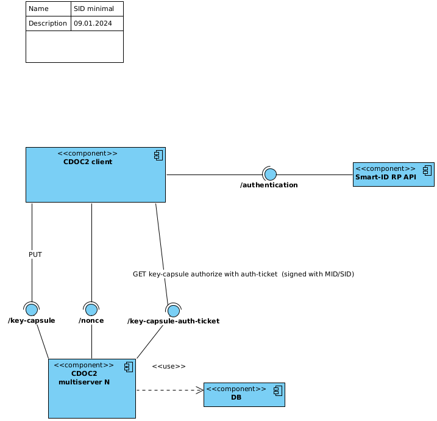
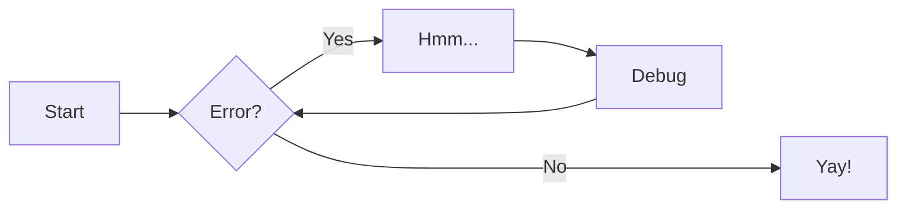

# Testing math and other features

## Testing mathematics

This math is inline $a^2+b^2=c^2$.

This is on a separate line
$$
f(x) = \int_{-\infty}^\infty
\hat f(\xi)\,e^{2 \pi i \xi x}
\,d\xi
$$


## Testing linking and references

1. Referring to another chapter: [Chapter 01](ch01_system_context.md)
2. Referring to another subsection anchor: [Section 2.1 - External systems](ch01_system_context.md#external_systems)
3. Referring to custom anchor defined by ourselves: not possible?
4. Referring footnote [^1]
5. Create an anchor [anchor](#anchors-in-markdown)

[^1]: This is the first footnote.

## Testing images and diagrams



*Figure 1: CDOC component diagram*

And referring to the diagram, later in the text. Not possible?

## Testing tables

First Header | Second Header | Third Header
:----------- |:-------------:| -----------:
Left         | Center        | Right
Left         | Center        | Right

## Testing code highlight

```python
def fn():
    pass
```

## Testing PlantUML diagrams

```plantuml
Goofy ->  MickeyMouse: calls
Goofy <-- MickeyMouse: responds
```
## Testing Mermaid

Another possibility might be <https://mermaid.js.org/intro/syntax-reference.html> (see 
<https://squidfunk.github.io/mkdocs-material/reference/diagrams/#diagrams>)

(for some reason not working here)


